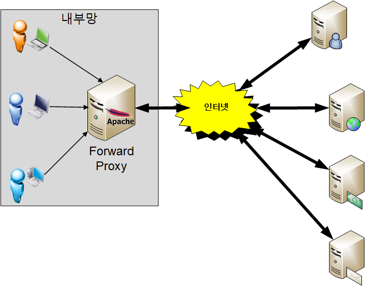
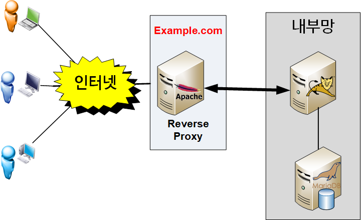
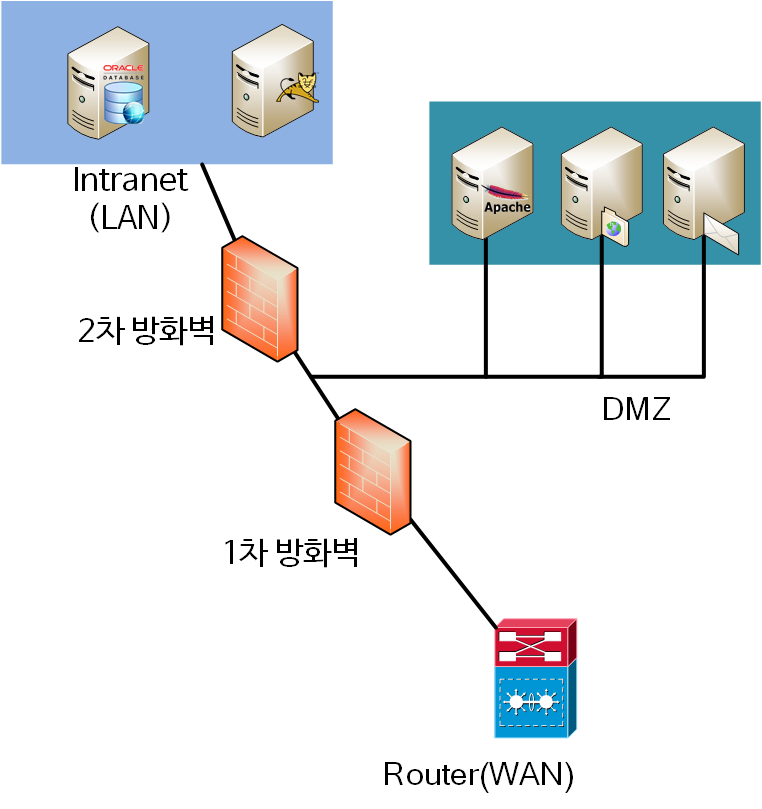

# 포워드 프록시(forward proxy) 리버스 프록시(reverse proxy) 의 차이


> `Web Server`와 `WAS` 에 대해 연동하려면 `Reverse Proxy` 에 대한 이해가 필수입니다.

#### 아파치 웹서버(apache web server) 에는 mod_proxy 라는 모듈에서 forward proxy 와 reverse proxy  두 가지 기능을 제공하며 nginx 는 필요한 기능만 제공하는 고성능 웹 서버에 맞게 reverse proxy 기능만 제공합니다.

#### 그러면 forward proxy 와 reverse proxy 간 차이점은 무엇일까요.

## `Forward Proxy`

#### Link to Forward Proxy
```
사용자가 google.com 에 연결하려고 하면 사용자 PC 가 직접 연결하는게 아니라 포워드 프록시 서버가 요청을 받아서 googlecom 에 연결하여 그 결과를 클라이언트에 전달(forward) 해 줍니다.
포워드 프록시는 대개 캐슁 기능이 있으므로 자주 사용되는 컨텐츠라면 월등한 성능 향상을 가져올 수 있으며 정해진 사이트만 연결하게 설정하는 등 웹 사용 환경을 제한할수 있으므로 보안이 매우 중요한 기업 환경등에서 많이 사용합니다.
```



## Reverse ProxyLink to Reverse Proxy

```
A 라는 회사가 example.com 이라는 고객용 웹 서비스를 만들었을 경우 이를 서비스하기 위해서는 리버스 프락시에 대한 이해가 필수입니다.
리버스 프락시로 웹 서버를 설정할 경우 사용자가 example.com 웹 서비스에 데이타를 요청하면 Reverse Proxy 는 이 요청을 받아서 내부 서버(보통 WAS 입니다)에서 데이타를 받은후에 이 데이타를 사용자에게 다시 전달하게 됩니다.
```



```
대부분의 WAS 는 Web Server 기능을 제공하므로 Reverse proxy 가 없이 내부 WAS 가 직접 서비스를 제공해도 되지만 이렇게 구성하는 이유중 여러가지가 있습니다.
```

# Reverse Proxy 장점Link to Reverse Proxy 장점

## 보안
```
보통 기업의 네트워크 환경은 비무장 지대(DMZ; Demilitarized Zone) 라고 하는 내부 네트워크와 외부 네트워크 사이에 위치하는 구간이 존재합니다.
```


```
위 그림과 같이 DMZ 내에 외부에 서비스를 제공하는 서버(메일 서버, 웹 서버, DNS 서버)를 배치하고 네트워크는 1, 2차 방화벽으로 보호합니다.

example.com 서비스를 제공하려면 WAS 를 DMZ 에 놓고 서비스해도 되지만 이런 서비스는 보통 내부의 DBMS 서버와 연결되어 있습니다.

만약 WAS 가 최전방에 있으면 WAS 가 털릴 경우 DBMS 와 관련 서버까지 모두 같이 털리는 심각한 보안 문제가 발생할 수 있습니다.

이때문에 DMZ 존에 웹 서버를 두고 리버스 프락시로 설정하고 WAS 는 내부망에 위치시키게 설정합니다.

리버스 프락시로 동작하는 웹 서버만 내부 WAS 와 연결하도록 설정하므로 웹 서버가 해킹당해도 2차 방화벽을 다시 뚫어야 하므로 더 보안에 강해질 수 있습니다.

특히 Red Hat 이나 CentOS 라면 SELinux 를 켜 놓으면 SELinux 의 강제 접근 통제에 따라 웹 서버는 사전 정해진 포트(예: WAS 의 8080, 8009)만 접근 할 수 있으므로 웹 서버가 해킹당해도 2차 피해를 최소화할 수 있습니다.
```

## 속도(Speed) 와 안정성

```
reverse proxy 개념을 이해하고 구성하면 이 앞에 Cache Server 를 붙이거나 SSL 하드웨어 가속기를 연동하는등 아키텍처 측면에서 성능 향상을 하기가 용이해 집니다.

아주 심플하게 생각하면 cloudflare 나 akamai 같은 CDN 도 Reverse proxy 로 동작하는 캐시 서버일뿐이니까요.

CDN 을 연동한다면 DDOS 공격을 효과적으로 방어하고 서비스를 빠르고 안정적으로 제공할 수 있습니다.
```

## 신뢰성(reliability) 증대
```
리버시 프락시를 cluster로 구성해 놓으면 가용성을 높일 수 있고 사용자가 증가하는 상황에 맞게 Web Server 나 WAS 를 유연하게 늘릴 수 있는 장점이 있습니다.

리버스 프록시 앞에 L4 나 load balancer 를 붙이면 Round Robin(RR), Least connection 등 상황에 맞는 분배 알고리즘을 적용해 서비스 신뢰성을 높일 수 있습니다.
```

#

> `Reverse Proxy` 로 서비스 제공시 WAS 에서 REMOTE_ADDR 을 가져오면 `Reverse Proxy` 서버의 IP 를 얻게 되므로 원하는 결과가 나오지 않습니다. Proxy(프락시) 환경에서 client IP 를 얻기 위한 X-Forwarded-For(XFF) http header 를 참고해서 XFF 헤더를 사용하면 됩니다.


